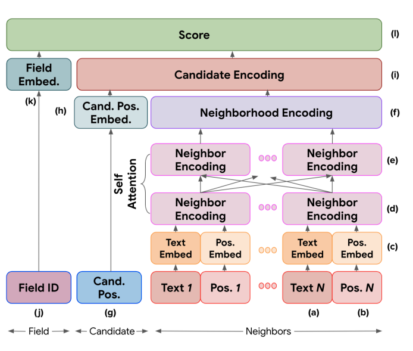
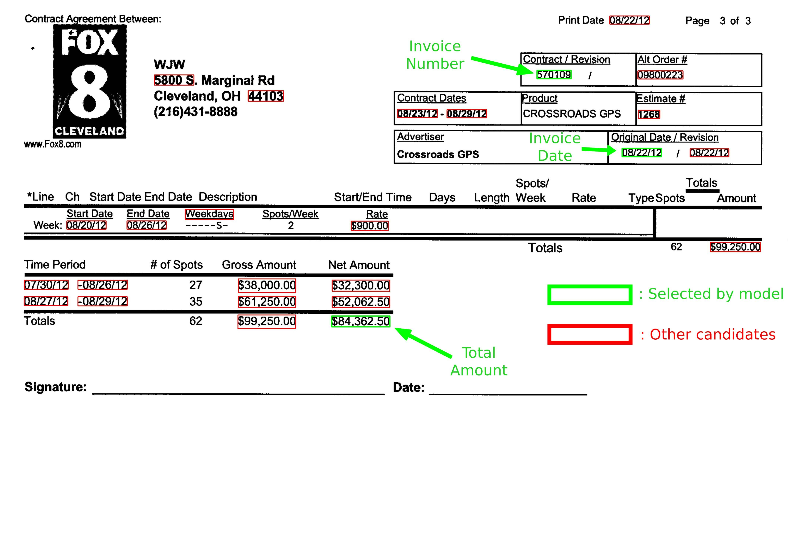

# ReLIE: Representation-Learning-for-Information-Extraction
This is an unofficial implementation of Representation Learning for Information Extraction ([ReLIE](https://research.google/pubs/pub49122/)) from Form-like Documents using PyTorch.

## Model Architecture



[image source](https://storage.googleapis.com/pub-tools-public-publication-data/pdf/59f3bb33216eae711b36f3d8b3ee3cc67058803f.pdf)

## Getting Started

1. Clone the repository
```
git clone https://github.com/Praneet9/Representation-Learning-for-Information-Extraction.git
```
2. Create a virtualenv and install the required packages
```
pip install -r requirements.txt
```


## Prepare dataset

#### STEP 1: Annotation  
Dataset can be created using an image annotation tool like [labelImg](https://github.com/tzutalin/labelImg) which we have used in this project or any other tool which saves annotations in pascalVOC format in an XML file.
To identify the true candidate for the required field, a bounding box must be drawn around the word which we want to extract.
For our experiment, we have annotated the following fields.

* Invoice Number
* Invoice Date
* Total Amount


#### STEP 2: Generate OCRs
*Prerequisites:*  
We used `tesseract 4.0` for generating OCR results  
You can install tesseract from its official source [here](https://github.com/tesseract-ocr/tesseract)  
Make sure you replace the default model with the LSTM model for best results.  
Download the LSTM models from [here](https://github.com/tesseract-ocr/tessdata)  
Once everything is setup, run the command below to generate tesseract results
which will be saved in the `tesseract_results_lstm` directory.
```
$ python generate_tesseract_results.py
```
#### STEP 3: Extract Candidates
Modify the [extract_candidates.py](extract_candidates.py) based on your dataset and classes.
* Invoice numbers : Use Regular Expressions to extract the candidates for invoice number (Ex. 221233,1041-553337)

* Amounts : Use Regular Expressions to extract the candidates for total amount (Ex. $222.32, $1200.44) 
* Dates : Use the [dateparser](https://github.com/scrapinghub/dateparser) to extract the candidates for invoice date
```
from dateparser.search import search_dates
search_dates(all_text)
```

#### STEP 4: Define dataset split and update config
**Split dataset into train and validation set**

specify dataset directory and split ratio in [utility script](./utils/prepare_split.py) and run:
```
python3 utils/prepare_split.py
```

Before running the training or evaluation script please modify the [configurations](./utils/config.py) as per your setup.

## Train
```
python3 train.py
```

## Evaluation
Coming Soon...
## Inference
* Get the inference results by running
```
python3 inference.py --image sample.jpg --cuda --cached_pickle output/cached_data.pickle --load_saved_model output/model.pth
```
**You can expect result something like this -** 

## Citation

##### Representation Learning for Information Extraction from Form-like Documents
_Bodhisattwa Prasad Majumder, Navneet Potti, Sandeep Tata, James B. Wendt, Qi Zhao, Marc Najork_ <br>

**Abstract** <br>
We propose a novel approach using representation learning for tackling the problem of extracting structured information from form-like
document images. We propose an extraction
system that uses knowledge of the types of the
target fields to generate extraction candidates,
and a neural network architecture that learns a
dense representation of each candidate based
on neighboring words in the document. These
learned representations are not only useful in
solving the extraction task for unseen document templates from two different domains,
but are also interpretable, as we show using
loss cases.

[[Paper]](https://storage.googleapis.com/pub-tools-public-publication-data/pdf/59f3bb33216eae711b36f3d8b3ee3cc67058803f.pdf) [[Google Blog]](https://ai.googleblog.com/2020/06/extracting-structured-data-from.html) 

```
@article{
  title={Representation Learning for Information Extraction from Form-like Documents},
  author={Bodhisattwa Prasad Majumder, Navneet Potti, Sandeep Tata, James B. Wendt, Qi Zhao, Marc Najork},
  journal = {Association for Computational Linguistics},
  year={2020}
}
```